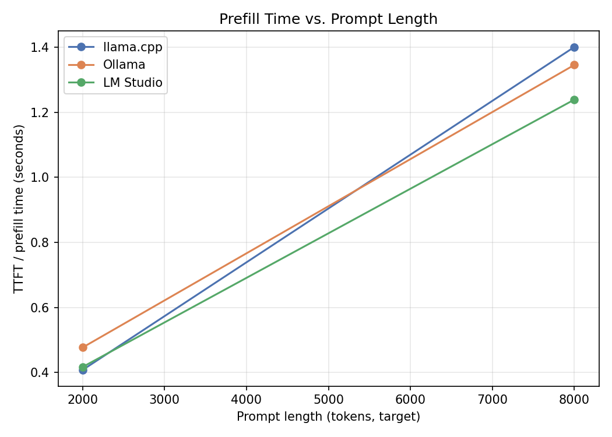
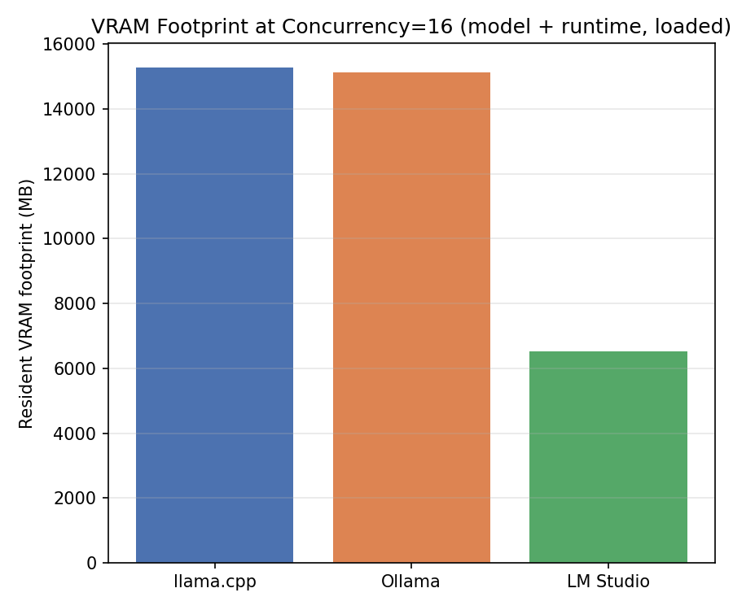
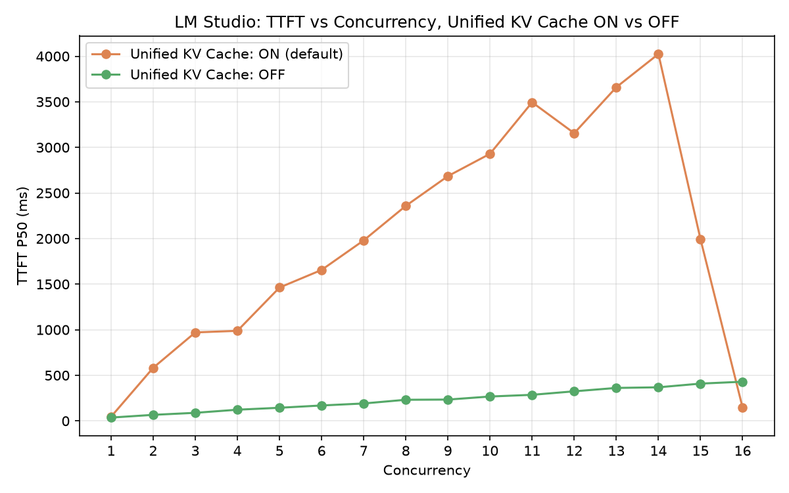

# Evaluation report

## Evidence status

This report distinguishes four kinds of statements:

- **Measured**: copied directly from a published aggregate CSV or JSON artifact.
- **Derived**: arithmetic or a chart computed from published aggregates.
- **Hardware-specific**: valid only for the recorded machine and software versions.
- **Inference**: a plausible explanation that is not proven by the public evidence.

`bench/results/provenance.json` pins every public artifact with SHA-256 and records the source
snapshot, environment, method, and publication boundary. `bench/results/claims.json` maps each
canonical display claim to a machine-readable selector. The control manifests are not
self-hashed; all 12 evidence artifacts beneath `bench/results/` are.

The release intentionally excludes request-level raw runs. It can verify aggregate integrity and
recompute the claims below, but it cannot independently recreate each aggregate from the original
requests.

## Recorded environment — hardware-specific

| Item | Recorded value |
|---|---|
| Date | 2026-07-17 |
| GPU | NVIDIA GeForce RTX 4090, 24,564 MiB |
| Driver | 591.86 |
| OS | Windows 11 Home, build 26200 |
| Model | `Ministral-3-8B-Instruct-2512-Q4_K_M.gguf` |
| Model size | 5,198,911,904 bytes |
| Model SHA-256 | `33e7a72cf5e6e2cfc2f2847075acc013d68bba023e35310cef86b5cf8fdca761` |
| llama.cpp | b10057, CUDA 12.4 build |
| Ollama | 0.32.0; recorded internal llama-server b9888 |
| LM Studio | `lms` CLI commit 9902c3a; runtime `llama.cpp-win-x86_64-nvidia-cuda12-avx2@2.25.2` |

All three frontends used the same GGUF, explicit OpenAI-compatible endpoints, temperature 0,
top-p 1.0, seed 42, and at most 256 generated tokens. Each case had three warmups and five timed
runs. Only one measured engine was resident on the GPU at a time.

## Aggregate decode throughput — measured

| Concurrency | llama.cpp (tok/s) | Ollama (tok/s) | LM Studio (tok/s) |
|---:|---:|---:|---:|
| 1 | 127.88 | 109.90 | 128.48 |
| 4 | 308.26 | 332.78 | 300.76 |
| 8 | 418.23 | 511.99 | 386.82 |
| 16 | 625.55 | 704.98 | 686.72 |

Source: `bench/results/concurrency_summary.csv`.

All published timed requests succeeded. Throughput rose with concurrency for all three recorded
frontends, with diminishing marginal gains. The relative spread varies by concurrency, so this
table does not support a single universal percentage-gap claim or a general engine ranking.

## Calibrated prefill — measured

| Target / actual tokens | llama.cpp median TTFT | Ollama median TTFT | LM Studio median TTFT |
|---|---:|---:|---:|
| 2,000 / 1,970 | 0.408 s | 0.477 s | 0.417 s |
| 8,000 / 7,880 | 1.401 s | 1.346 s | 1.239 s |

LM Studio: 1.239 s median TTFT at the 8,000-token target

Source: `bench/results/prefill_summary.csv`, with the exact synthetic inputs under
`bench/results/prompts/`.

## Resident VRAM — measured and derived

At concurrency 16, the recorded resident baselines were 15,271 MiB for llama.cpp, 15,138 MiB for
Ollama, and 6,515 MiB for LM Studio.

LM Studio's 6,515 MiB baseline was 42.7% of llama.cpp's 15,271 MiB baseline at concurrency 16

The 42.7% figure is derived as `6515 / 15271 × 100`, rounded to one decimal place. It describes
this specific configuration, not a general memory-efficiency guarantee.

## Unified KV Cache control — measured observation and inference

Two LM Studio concurrency 1–16 scans changed one recorded setting:

- LM Studio Unified KV Cache ON: 4,024 ms p50 TTFT at concurrency 14
- LM Studio Unified KV Cache OFF: 430 ms p50 TTFT at concurrency 16

With the setting enabled, p50 TTFT climbed through concurrency 14, then dropped sharply at 15–16.
With it disabled, the published curve increased more smoothly from 36 ms at concurrency 1 to
430 ms at concurrency 16. This controlled observation supports the practical statement that the
setting affected the recorded latency curve.

It does **not** prove why. A shared memory pool, slot allocation, or scheduler fast path could
explain the shape, but the public artifacts contain no LM Studio internal trace. Those mechanisms
remain hypotheses.

## Gateway latency — measured

The published gateway check compared the same backend directly and through the FastAPI gateway:
9.73655 ms direct median TTFT versus 11.39325 ms through the gateway, a measured difference of
1.65670 ms. This small local result does not predict overhead under network latency, logging
contention, multiple workers, or production load.

## Cache-control methodology

Every measured request prepended a random eight-character nonce to the user prompt. The nonce was
placed early so the remaining prefix could not reuse the preceding request's KV state. After this
method correction, the published aggregate runs were collected again. Exact historical
before/after cache-hit timings are not included because no public artifact supports those numbers.

## What the evidence does not establish

- It does not establish a fixed per-request architectural tax for any engine.
- It does not establish the internal cause of the LM Studio memory or latency behavior.
- It does not generalize beyond the recorded hardware, driver, engine versions, model, and flags.
- It does not provide raw request records for independent re-aggregation.
- It does not compare quality, energy consumption, cold-start time, or multi-host serving.
