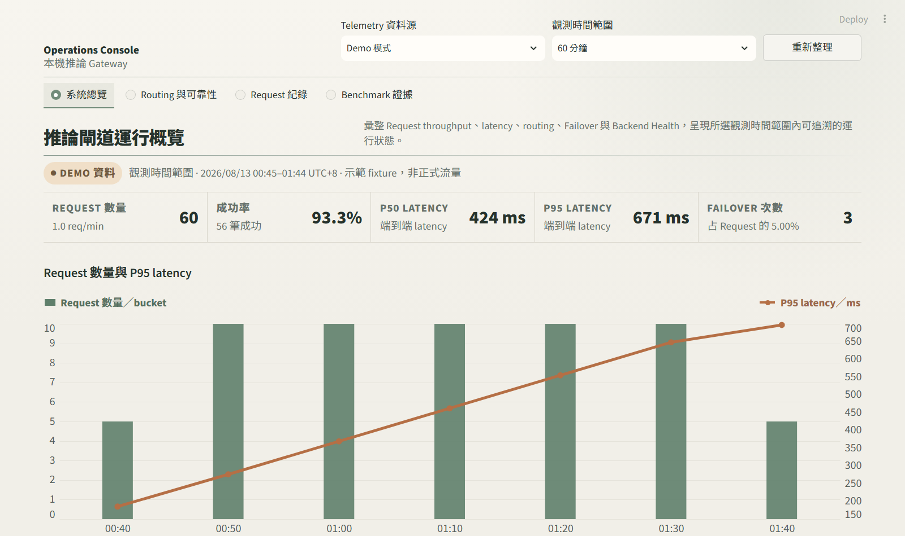
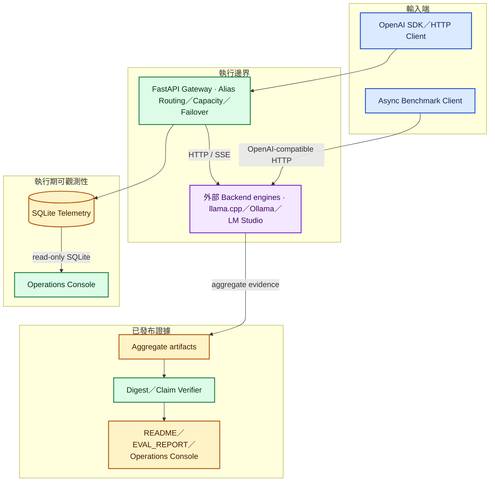
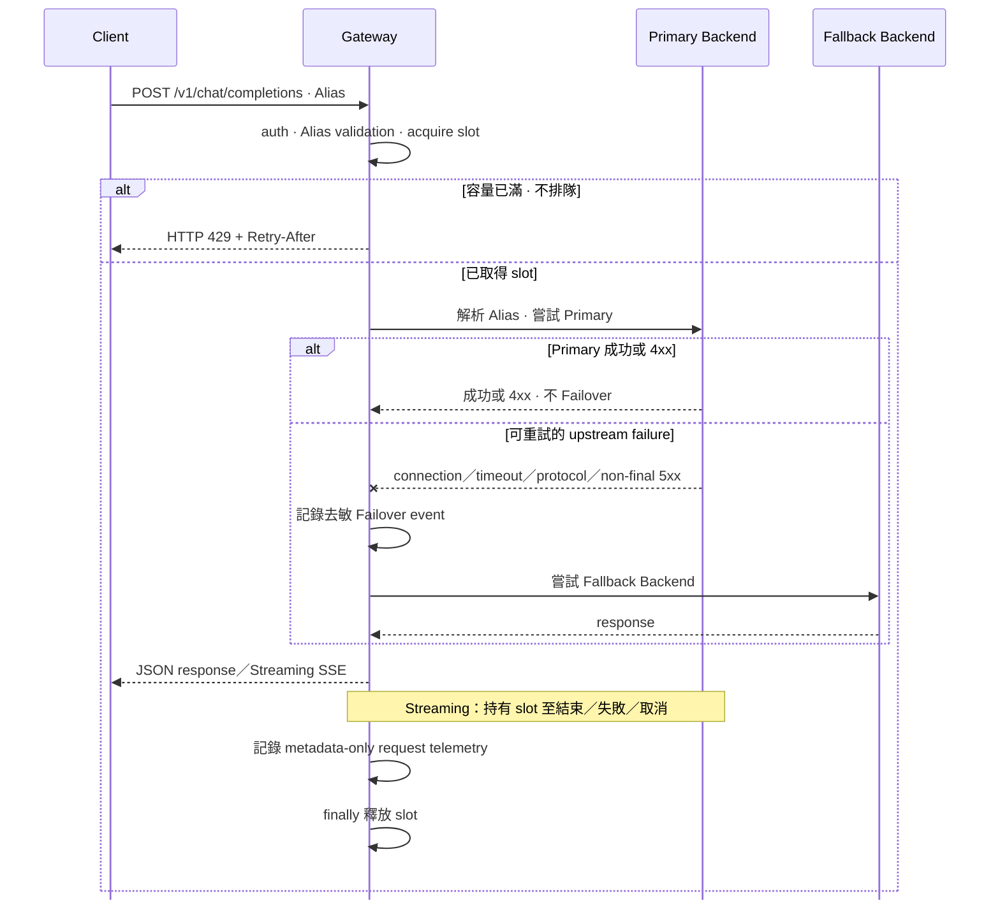
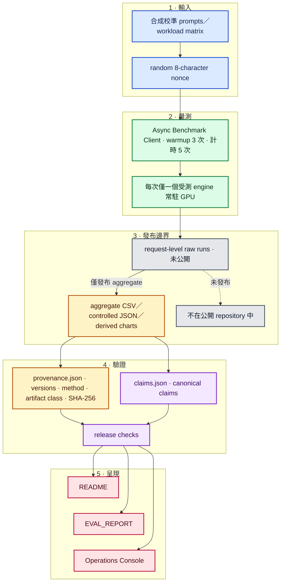
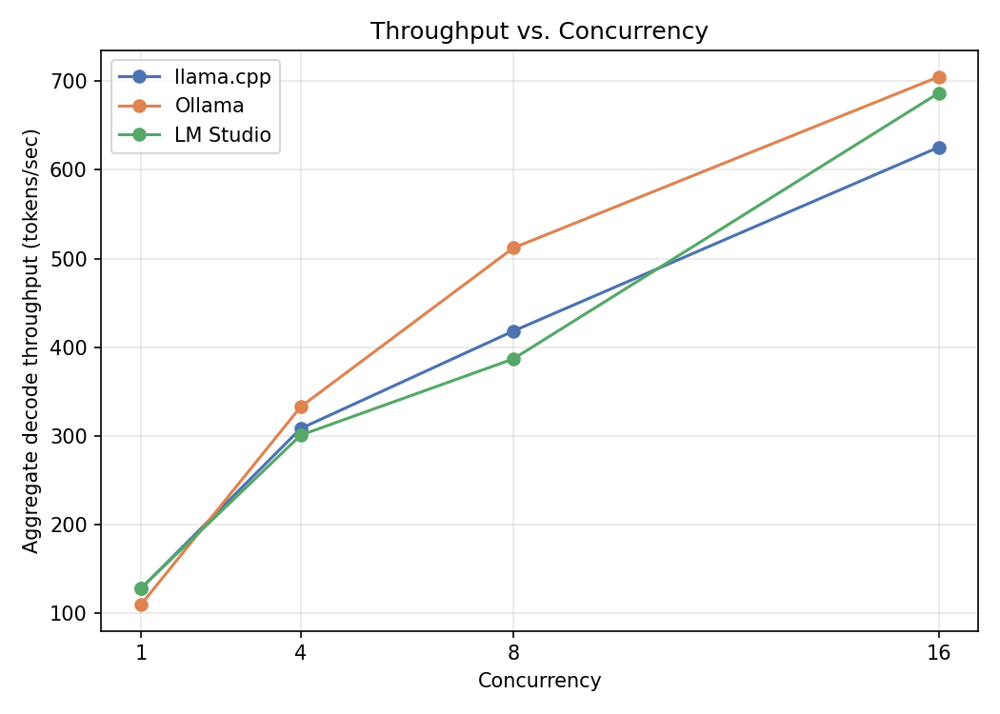

# Local Inference Benchmark + OpenAI-Compatible Gateway

[](https://github.com/kuotunyu/local-inference-bench-gateway/actions/workflows/ci.yml)

[](LICENSE)

一個 evidence-first 的本機推論工程專案：以共同 workload 比較 llama.cpp、Ollama 與 LM Studio，並提供具備 Alias Routing、ordered Failover、Backpressure、Streaming pass-through 與 SQLite Telemetry 的 OpenAI-compatible FastAPI Gateway。

這個 repository 將共同 Async Benchmark Client、OpenAI-compatible FastAPI Gateway 與 evidence-first Operations Console 組合成一個可審查系統。llama.cpp、Ollama 與 LM Studio 這些 Backend engines 都是另行安裝、啟動與管理的外部程序。



## 工程能力與驗證範圍

- 用同一個 Async Benchmark Client 與 workload matrix 比較三種本機 OpenAI-compatible Backend engines，同時保留可驗證的 aggregate evidence。
- Gateway 讓用戶端只需使用穩定 Alias，由 Model Registry 依序嘗試 Backend；容量滿載時回覆 HTTP 429，不建立無上限的 in-memory queue。
- Operations Console 清楚區分 Demo、Live 與 Benchmark Evidence，不把示範資料包裝成實際流量，也不把 aggregate artifact 當成 request-level raw data。
- CPU-only reviewer 不需 GPU、模型權重或推論引擎，即可檢視 UI、重算 canonical claims 並執行 release policy checks。

## 系統邊界

這張圖將 request path、benchmark path 與 evidence / observability surface 放在同一個邊界視圖中，讓元件責任與資料流向可以分層閱讀。



真正載入模型的 Backend engines 位於 repository 邊界外；Operations Console 只以 read-only 方式呈現 Telemetry 與已提交的 aggregate evidence，不是 Gateway control plane。

## Request 與 Failover 流程

每個 request 都依 Alias 的 ordered Backend chain 在當下重新嘗試；Health poller 只提供觀測結果，不會成為 request-time routing oracle。



Streaming request 從上游連線開始到 stream 結束、失敗或取消之前都佔用 limiter slot。如果連線已開始後才發生讀取錯誤，Gateway 會終止 stream 並記錄受控類別，不會偽造 `[DONE]` 或中途切換 Backend。

## Benchmark 證據鏈

這條證據鏈用五個 stage 分開 input、measurement、publication boundary、verification 與 presentation；每個 measured request 都先加入 random nonce，避免 repeated prefix cache 改變 prefill 量測性質。



`bench/results/provenance.json` 記錄環境、方法、artifact class 與 SHA-256；`bench/results/claims.json` 再把每個 canonical display claim 綁定到可重算的 selector。Release checks 可驗證 aggregate integrity 與 claim 內容，但無法從未公開的原始 request 獨立重新彙總。

## 量測結果與解讀邊界

以下是 **2026-07-17** 在單張 **NVIDIA GeForce RTX 4090** 與當時釘住的 model、driver、engine version 及 flags 所量得的 hardware- / version-specific snapshot：

- llama.cpp: 625.55 tok/s at concurrency 16
- Ollama: 704.98 tok/s at concurrency 16
- LM Studio: 686.72 tok/s at concurrency 16
- Gateway median TTFT overhead: 1.66 ms

這些數字不是跨硬體、跨版本或跨 workload 的引擎排名；三個引擎的差距也會隨 concurrency 改變。完整環境、方法、表格與解讀限制請見 [EVAL_REPORT.md](EVAL_REPORT.md)。



## Operations Console

Operations Console 是 evidence-first 的 reviewer / operator 介面，但三個資料源回答的問題不同：

| 資料源 | Truth boundary |
|---|---|
| Demo | Demo Mode — deterministic illustrative fixture，非 production traffic |
| Live | Live Mode — metadata-only local telemetry |
| Evidence | Benchmark Evidence — aggregate evidence；request-level raw runs 未公開 |

Demo Mode 不需 Gateway、GPU、model 或 runtime database。Live Mode 以 read-only 方式讀取 `GATEWAY_DB_PATH` 指向的 SQLite；Benchmark Evidence 則讀取已提交的 aggregate CSV / JSON、圖表與 provenance digest。Console 不推測當前 queue depth、live GPU utilization、historical uptime 或 SLA。

## Quickstart

### A. 啟動 loopback Operations Console

```powershell
uv sync --frozen --extra dashboard
uv run streamlit run dashboard/app.py --server.address 127.0.0.1
```

沒有可用的 Live database 時，Console 會以標示清楚的 Demo Mode 啟動。

### B. 設定 registry 後啟動 loopback Gateway

先編輯 `gateway/models.yaml`，讓 Alias 指向你另行安裝與操作的 OpenAI-compatible Backend engines：

```powershell
Copy-Item .env.example .env
uv sync --frozen --extra dev
uv run uvicorn gateway.app:app --host 127.0.0.1 --port 9000
```

### C. 執行 frozen CPU verification

```powershell
uv sync --frozen --all-extras
uv run --frozen ruff check .
uv run --frozen ruff format --check .
uv run --frozen pytest -q
uv run --frozen python -m release_checks.cli
```

這個 repository **不會安裝或啟動 Backend engine**。CPU reviewer path 只使用 mocked HTTP backends、temporary SQLite 與靜態 aggregate evidence，不會連線 `gateway/models.yaml` 內的 engine URL。

## 設計決策與誠實範圍

- Gateway 是 **single-process** 的 **single-workstation** reference implementation。Process-local limiter 不會在多個 Uvicorn workers 之間共享計數；多機部署需要另一組 concurrency control 與 telemetry store 設計。
- SQLite 只儲存 timestamp、Alias / Backend / model identifiers、stream flag、status、success、aggregate token counts、latency 與受控 failure category。它不儲存 request messages、authorization headers、raw upstream bodies 或 exception strings。
- Failover 處理 connection error、timeout、protocol error 與 non-final 5xx，但不提供 distributed consensus、cross-host scheduling 或 durable queues。
- 公開的 artifact 能支持 measured 與 derived claims，但不足以證明引擎內部 scheduler、memory allocation 或 cache mechanism 的成因。
- GPU benchmark 不會在 CI 重跑；更換硬體、版本、model 或 flags 都是新實驗，不應靜默取代 2026-07-17 evidence snapshot。

## Repository map 與延伸文件

| Path | Purpose |
|---|---|
| `gateway/` | OpenAI-compatible routes、registry、Backend I/O、Failover、auth、capacity 與 SQLite logs |
| `bench/` | Async Benchmark Client、workload、runner、analysis、aggregate evidence 與 charts |
| `dashboard/` | Demo / Live Operations Console 與 committed Benchmark Evidence |
| `release_checks/` | Network-free evidence、documentation 與 publication policy checks |
| `tests/` | CPU-only behavior、evidence、publication、documentation 與 Docker-policy tests |
| `docker/smoke/` | CPU-only mock Backend engines 與 end-to-end smoke client |

- [EVAL_REPORT.md](EVAL_REPORT.md) — 量測環境、方法、數值、evidence classes 與 caveats
- [DESIGN.md](DESIGN.md) — Gateway behavior、request lifecycle 與 engineering trade-offs
- [SETUP.md](SETUP.md) — CPU reviewer、本機 runtime 與 optional GPU reproduction boundary
- [PRODUCTION_SCALING.md](PRODUCTION_SCALING.md) — 離開單機邊界後必須改變的設計
- [Third-party notices](THIRD_PARTY_NOTICES.md) — licensing 與 redistribution boundaries
- [Source audit](docs/SOURCE_AUDIT.md) — source-to-public boundary 與 clean-lineage audit

## License

本 repository 的 original code 以 scoped [MIT License](LICENSE) 授權。第三方 models、engines、packages、產品名稱與 benchmark facts 不因此被重新授權。
