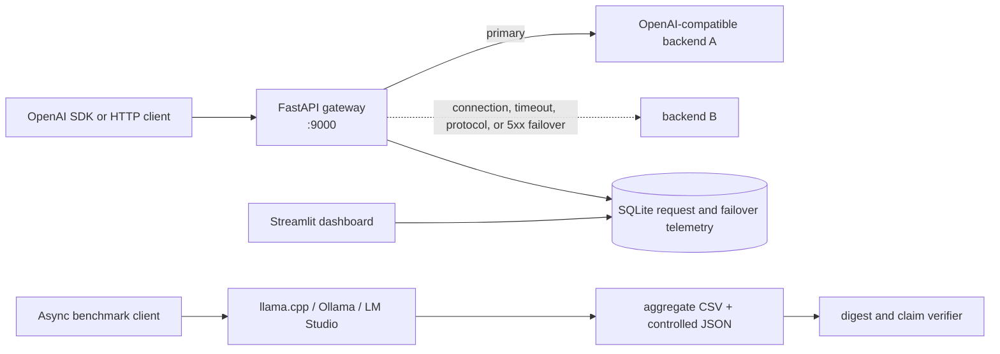

# Local Inference Benchmark + OpenAI-Compatible Gateway

An evidence-first, single-workstation portfolio project: one benchmark client compares three
local GGUF inference frontends, while a FastAPI gateway provides model aliases, ordered
failover, streaming pass-through, API-key auth, per-alias capacity limits, and local SQLite
telemetry.

This repository is a local release candidate. It contains source code and aggregate benchmark
evidence, but no model weights, inference-engine binaries, secrets, runtime database, or
request-level raw benchmark runs.

## Review it without a GPU

The complete reviewer path is CPU-only and does not start an inference engine:

```bash
uv sync --frozen --all-extras
uv run --frozen ruff check .
uv run --frozen ruff format --check .
uv run --frozen pytest -q
uv run --frozen python -m release_checks.cli
```

The evidence-only check uses the Python standard library and finishes without network, model,
or GPU access:

```bash
uv run --frozen python -m release_checks.evidence
```

## Operations Console

The Streamlit Operations Console turns the gateway's SQLite telemetry and the committed benchmark
artifacts into one evidence-first interface. It is designed for both a first-time reviewer and a
local operator:

- **Demo Mode** opens automatically when no compatible live database exists. Its deterministic
  fixture is always labeled `DEMO DATA`; it is illustrative traffic, not an unpublished benchmark
  run or production sample.
- **Live Mode** reads `GATEWAY_DB_PATH` in read-only mode and shows request volume, success rate,
  P50/P95 latency, Alias Routing, current Backend Health, Failover Events, observed Backpressure,
  and a filterable Request Explorer.
- **Benchmark Evidence** reads the committed aggregate CSV/JSON files, verifies their published
  SHA-256 digests, and keeps measurement date, hardware, versions, method, and publication boundary
  next to the charts.

No GPU, model, inference backend, gateway process, or runtime database is required to review Demo
Mode and Benchmark Evidence:

```bash
uv sync --frozen --extra dashboard
uv run streamlit run dashboard/app.py --server.address 127.0.0.1
```

The console deliberately does not invent queue depth, live GPU utilization, historical uptime, or
SLA metrics that the current telemetry schema cannot prove.

## Recorded result snapshot

At concurrency 16, using one RTX 4090 and the pinned environment described in
[EVAL_REPORT.md](EVAL_REPORT.md):

- llama.cpp: 625.55 tok/s at concurrency 16
- Ollama: 704.98 tok/s at concurrency 16
- LM Studio: 686.72 tok/s at concurrency 16
- Gateway median TTFT overhead: 1.66 ms

These are hardware- and version-specific measurements, not general rankings. The gap is not
uniform across concurrency levels; at concurrency 8, for example, the spread is materially
larger than at concurrency 16.


Each warmup and timed request received a random eight-character nonce at the start of its user
prompt. Changing an early token invalidates the shared prefix, preventing repeated prompts from
turning a prefill benchmark into a prefix-cache benchmark. The published prompt fixtures are
synthetic calibrated inputs.

## Architecture



The health poller is observational only. Request-time failover always tries the ordered backend
chain instead of trusting possibly stale health state. Capacity is rejected with HTTP 429 rather
than queued indefinitely. Streaming keeps the limiter slot until the upstream stream closes.

## Honest scope and limitations

- This is a single-process, single-workstation reference system, not a multi-tenant production
  control plane.
- Aggregate summaries and charts are public; request-level raw runs are not. The release checks
  verify published artifacts and recompute canonical claims, but cannot independently
  re-aggregate the original requests.
- The GPU benchmark was recorded on 2026-07-17 and is not rerun by CI or reviewer checks.
- Failover covers connection failures, timeouts, malformed upstream JSON, and non-final 5xx
  responses. It does not provide distributed consensus, cross-host scheduling, or durable queues.
- SQLite is deliberately local. A multi-worker deployment needs a shared telemetry store and a
  different concurrency-control design.
- The observed effect of LM Studio's Unified KV Cache setting is measured; an explanation based
  on internal allocation or scheduling behavior remains a hypothesis.

## Repository map

| Path | Purpose |
|---|---|
| `gateway/` | OpenAI-compatible routes, backend I/O, failover, auth, capacity, and SQLite logs |
| `bench/` | Shared benchmark client, runner, analysis, aggregate evidence, and charts |
| `release_checks/` | Network-free evidence and publication policy checks |
| `tests/` | CPU-only behavioral, evidence, publication, documentation, and Docker-policy tests |
| `dashboard/` | Demo/Live Operations Console plus committed Benchmark Evidence |
| `docker/smoke/` | CPU-only mock backends and end-to-end smoke client |
| `docs/SOURCE_AUDIT.md` | Source-to-public boundary and clean-lineage audit |
| `docs/RELEASE_DESIGN.md` | Public release architecture and boundary decisions |

## Start the local gateway

See [SETUP.md](SETUP.md) for native and Docker setup. The shortest native development path is:

```bash
uv sync --frozen --extra dev
copy .env.example .env
uv run uvicorn gateway.app:app --host 127.0.0.1 --port 9000
```

Edit `gateway/models.yaml` so its aliases point at OpenAI-compatible services you control. No
backend is installed or started by this repository.

## Documentation

- [Evaluation report](EVAL_REPORT.md): environment, method, tables, evidence classes, caveats
- [Design](DESIGN.md): gateway behavior and engineering tradeoffs
- [Setup](SETUP.md): CPU reviewer flow, local runtime, and optional GPU reproduction boundary
- [Production scaling](PRODUCTION_SCALING.md): what must change beyond one workstation
- [Third-party notices](THIRD_PARTY_NOTICES.md): licensing and redistribution boundaries
- [Owner actions](OWNER_ACTIONS.md): decisions intentionally left to the repository owner

Original code is available under the scoped [MIT license](LICENSE). Third-party models, engines,
packages, product names, and benchmark facts are not relicensed by that file.
