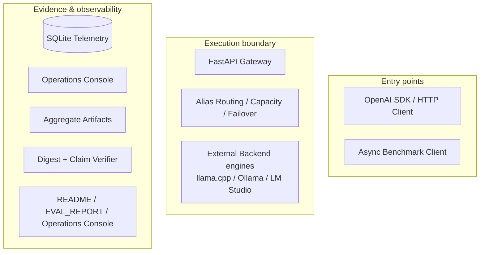

# README Diagram Readability Implementation Plan

> **For agentic workers:** REQUIRED SUB-SKILL: Use superpowers:subagent-driven-development (recommended) or superpowers:executing-plans to implement this plan task-by-task. Steps use checkbox (`- [ ]`) syntax for tracking.

**Goal:** 重構 README 的三張 Mermaid 圖與周邊文案，使 System Context、Failover lifecycle 與 Benchmark evidence pipeline 在 GitHub 預設內容寬度下可直接閱讀。

**Architecture:** README 繼續使用 GitHub-native Mermaid，不新增固定 SVG asset。兩張 flowchart 採外層 `TB`、stage 內層 `LR` 的混合方向；Sequence Diagram 精簡 participant 與 message，並以 contract tests 鎖定 truth boundaries、zh-TW heading 與移除舊導覽。

**Tech Stack:** Markdown、Mermaid、pytest、Python 3.12、Ruff、GitHub Actions、GitHub README renderer

## Global Constraints

- 正體中文（zh-TW）為主要敘事語言；Gateway、Backend、Alias、Failover、Backpressure、Streaming、Telemetry、provenance、claims 等保留原文。
- 不修改 Gateway、Benchmark、Dashboard、SQLite schema、canonical benchmark claims 或 release policy。
- 保留三張圖且各自只回答一個問題；不新增第四張圖。
- Mermaid 必須維持 GitHub-native code block、high-contrast `classDef` 與 light / dark mode 可讀性。
- Demo、Live、aggregate evidence 與 unpublished raw runs 的 truth boundary 不得改變。
- README 總長度大致持平或下降，不新增導覽、badge wall、裝飾性 banner 或外部圖床。

---

## File Map

- `README.md`：移除舊導覽、更新三個 section heading、重構三張 Mermaid 與精簡圖前後文案。
- `tests/test_readme_portfolio.py`：鎖定新 heading order、diagram direction、semantic boundaries、sequence participant 精簡及舊導覽移除。
- `docs/superpowers/specs/2026-08-13-readme-diagram-readability-design.md`：已核准的需求來源，不在實作中改寫。
- `docs/superpowers/plans/2026-08-13-readme-diagram-readability.md`：本執行計畫。

### Task 1: 建立 README 可讀性 contract

**Files:**
- Modify: `tests/test_readme_portfolio.py`
- Test: `tests/test_readme_portfolio.py`

**Interfaces:**
- Consumes: `_readme() -> str`、`_mermaid_blocks(text: str) -> list[str]`、`_level_two_headings(text: str) -> list[str]`、`_assert_high_contrast_class_defs(...)`。
- Produces: 新的 README structure / diagram contract，供 Task 2 實作通過。

- [ ] **Step 1: 更新 heading order 與舊導覽移除 contract**

將 `PORTFOLIO_SECTION_ORDER` 中三個圖解 heading 改成：

```python
PORTFOLIO_SECTION_ORDER = (
    "一眼看重點",
    "系統邊界（System Context）",
    "Request 與 Failover 流程",
    "Benchmark 證據鏈（Evidence Pipeline）",
    "量測結果與解讀邊界",
    "Operations Console",
    "Quickstart",
    "設計決策與誠實範圍",
    "Repository map 與延伸文件",
    "License",
)
```

在 `test_readme_has_zh_tw_portfolio_information_architecture` 加入：

```python
assert "一眼看重點 · System Context · Benchmark Evidence · Quickstart · 延伸文件" not in text
```

- [ ] **Step 2: 更新 System Context contract**

將原本要求 `flowchart LR` 的斷言改成以下結構與核心語意：

```python
assert "flowchart TB" in system_context
for group in (
    'subgraph Entry["Entry points"]',
    'subgraph Execution["Execution boundary"]',
    'subgraph Evidence["Evidence & observability"]',
    "direction LR",
):
    assert group in system_context
for semantic_group in (
    "OpenAI SDK / HTTP Client",
    "Async Benchmark Client",
    "FastAPI Gateway",
    "Alias Routing / Capacity / Failover",
    "External Backend engines",
    "SQLite Telemetry",
    "Operations Console",
    "Aggregate Artifacts",
    "Digest + Claim Verifier",
    "README / EVAL_REPORT / Operations Console",
):
    assert semantic_group in system_context
```

保留 `HTTP / SSE`、`read-only SQLite`、`aggregate evidence` 與 high-contrast class contract。

- [ ] **Step 3: 更新 Sequence Diagram contract**

participant contract 改為：

```python
for participant in ("Client", "Gateway", "Primary", "Fallback", "Telemetry"):
    assert f"participant {participant}" in failover_lifecycle
assert "participant Limiter" not in failover_lifecycle
```

保留以下 lifecycle boundary：

```python
for lifecycle_boundary in (
    "HTTP 429 + Retry-After",
    "success or 4xx: no Failover",
    "sanitized Failover event",
    "hold slot until stream end / failure / cancellation",
    "metadata-only request telemetry",
    "release slot in finally",
):
    assert lifecycle_boundary in failover_lifecycle
```

- [ ] **Step 4: 更新 Evidence Pipeline contract**

要求 outer `TB` 與五個 stage：

```python
assert "flowchart TB" in evidence_pipeline
for stage in (
    'subgraph Inputs["1 · Inputs"]',
    'subgraph Measurement["2 · Measurement"]',
    'subgraph Boundary["3 · Publication boundary"]',
    'subgraph Verification["4 · Verification"]',
    'subgraph Presentation["5 · Presentation"]',
):
    assert stage in evidence_pipeline
```

核心 evidence contract：

```python
for semantic_group in (
    "Synthetic calibrated prompts / workload matrix",
    "random 8-character nonce",
    "Async Benchmark Client",
    "one measured engine resident on GPU",
    "request-level raw runs",
    "not public",
    "aggregate CSV / controlled JSON / derived charts",
    "provenance.json",
    "claims.json",
    "release checks",
    "README",
    "EVAL_REPORT",
    "Operations Console",
):
    assert semantic_group in evidence_pipeline
assert "-. not published .->" in evidence_pipeline
```

- [ ] **Step 5: 執行 focused test，確認 RED**

Run:

```powershell
uv run --frozen pytest tests/test_readme_portfolio.py -q
```

Expected: README structure / Mermaid contract tests FAIL，原因為舊 heading、舊導覽與兩張 `flowchart LR` 尚未改寫；既有 hero、CPU verification 與 source-boundary tests 仍 PASS。

### Task 2: 重構 README 文案與三張 Mermaid

**Files:**
- Modify: `README.md`
- Test: `tests/test_readme_portfolio.py`

**Interfaces:**
- Consumes: Task 1 的 heading、semantic group、classDef 與 truth-boundary contract。
- Produces: GitHub-native README，包含可讀的 mixed-direction architecture / evidence flow 與精簡 Sequence Diagram。

- [ ] **Step 1: 移除舊導覽並更新圖解 heading**

完整刪除：

```markdown
[一眼看重點](#一眼看重點) · [System Context](#system-context) · [Benchmark Evidence](#benchmark-evidence-pipeline) · [Quickstart](#quickstart) · [延伸文件](#repository-map-與延伸文件)
```

將三個 heading 改為：

```markdown
## 系統邊界（System Context）
## Request 與 Failover 流程
## Benchmark 證據鏈（Evidence Pipeline）
```

- [ ] **Step 2: 將 System Context 改成三層 mixed-direction flowchart**

使用此結構實作，node label 可在不改語意的前提下做兩行排版：



連線必須表達 Client → Gateway → Policy → Engines、Bench → Engines、Gateway → Telemetry → Console，以及 Bench / Engines → Aggregates → Verifier → Surfaces。Backend engines 使用 external class，repository-owned boundary 不得包含 Engines。

- [ ] **Step 3: 精簡 Sequence Diagram**

使用五個 participant。Gateway 內部完成 auth、Alias validation、capacity acquire 與 ordered chain resolution；以 `alt capacity exhausted`、`alt primary result` 與 `opt Streaming SSE` 保留必要分支。Capacity note 使用：

```mermaid
Note over Gateway: capacity slot is process-local<br/>no unbounded in-memory queue
```

message 使用 Task 1 鎖定的短句，最後順序為 metadata-only telemetry → release slot in finally。

- [ ] **Step 4: 將 Evidence Pipeline 改成五階段 mixed-direction flowchart**

建立五個 `subgraph`，外層 `flowchart TB`；每個 stage 內使用 `direction LR`。Raw node 使用 unpublished class，並加入：

```mermaid
Raw -. not published .-> Private["Outside the public repository"]
```

公開主路徑為 Raw → Aggregate → Provenance / Claims → Checks → README / EVAL_REPORT / Operations Console。`provenance.json` 與 `claims.json` 並列，兩者都連到 release checks。

- [ ] **Step 5: 精簡三張圖前後文案**

每張圖前只用一個短段落描述問題；圖後只保留：

- System Context：Backend engines 位於 repository 外，Console 是 read-only surface。
- Sequence：health poller observational、Streaming 不偽造 `[DONE]` 或中途切換 Backend。
- Evidence：aggregate 可驗證範圍與 raw runs 未公開造成的 re-aggregation limitation。

- [ ] **Step 6: 執行 focused tests，確認 GREEN**

Run:

```powershell
uv run --frozen pytest tests/test_readme_portfolio.py -q
```

Expected: all tests in `tests/test_readme_portfolio.py` PASS。

- [ ] **Step 7: Commit README implementation**

```powershell
git add -- README.md tests/test_readme_portfolio.py
git diff --cached --check
git commit -m "docs: improve README diagram readability"
```

### Task 3: Mermaid render 與視覺修正

**Files:**
- Modify if render review finds a defect: `README.md`
- Modify only when contract must match a justified semantic-preserving visual change: `tests/test_readme_portfolio.py`
- Temporary outputs only: `$env:TEMP/local-inference-readme-diagrams/`

**Interfaces:**
- Consumes: README 的三個 Mermaid code blocks。
- Produces: 三張 parser-valid、無 clipping、GitHub 寬度下可讀的 render；temporary PNG / SVG 不加入 repository。

- [ ] **Step 1: Extract Mermaid blocks**

```powershell
$diagramTemp = Join-Path $env:TEMP 'local-inference-readme-diagrams'
New-Item -ItemType Directory -Force -Path $diagramTemp | Out-Null
uv run --frozen python "$env:USERPROFILE/.agents/skills/design-doc-mermaid/scripts/extract_mermaid.py" README.md --output-dir $diagramTemp --prefix readme
```

Expected: three `.mmd` files under `$diagramTemp`。

- [ ] **Step 2: Render all diagrams with pinned Mermaid CLI**

```powershell
$diagramChrome = Join-Path $env:ProgramFiles 'Google/Chrome/Application/chrome.exe'
$env:PUPPETEER_EXECUTABLE_PATH = $diagramChrome
Get-ChildItem -LiteralPath $diagramTemp -Filter '*.mmd' | ForEach-Object {
    $renderPath = [System.IO.Path]::ChangeExtension($_.FullName, '.png')
    npx --yes @mermaid-js/mermaid-cli@11.12.0 -i $_.FullName -o $renderPath -b transparent -w 1050
    if ($LASTEXITCODE -ne 0) { exit $LASTEXITCODE }
}
```

Expected: exit 0 and three non-empty PNG files。

- [ ] **Step 3: 視覺檢查三張 PNG**

逐張確認：

- node / participant label 可直接閱讀。
- 沒有 overlap、clipping、極端空白或錯誤換行。
- System Context 與 Evidence Pipeline 呈現明顯的縱向主流程，不再是約 180 px 的扁平長條。
- Evidence Pipeline 的 `not public` 支線與公開主路徑能立即分辨。
- Sequence Diagram 比舊版緊湊，且 Backpressure、Failover、Streaming、Telemetry、finally release 仍完整。

- [ ] **Step 4: 修正發現的視覺問題並重新驗證**

只可調整 `direction`、label 換行、node order、spacing、class color 或短文案；每次修改後重新執行 Task 2 focused tests 與 Task 3 render commands，直到三張圖通過。

- [ ] **Step 5: Commit render-driven refinements（有差異時）**

```powershell
git add -- README.md tests/test_readme_portfolio.py
git diff --cached --check
git commit -m "docs: refine README diagram layout"
```

若 Step 3 未要求任何 source 修改，略過此 commit。

### Task 4: 完整驗證、發布與 GitHub render 驗收

**Files:**
- No expected source changes
- CI workflow: `.github/workflows/ci.yml`（只執行，不修改）

**Interfaces:**
- Consumes: 已通過 focused tests 與 Mermaid render 的 README commits。
- Produces: clean repository、完整本機 verification、non-force push、green CI 與公開 GitHub README desktop / narrow render evidence。

- [ ] **Step 1: 執行完整本機 verification**

```powershell
uv run --frozen ruff check .
uv run --frozen ruff format --check .
uv run --frozen pytest -q
uv run --frozen python -m release_checks.cli
git diff --check
git status --short
```

Expected: Ruff、format、pytest、release checks、diff check 全部 PASS，working tree clean。

- [ ] **Step 2: 執行安全 publication preflight**

```powershell
git fetch origin main
git merge-base --is-ancestor origin/main HEAD
git log --oneline origin/main..HEAD
```

Expected: ancestry command exit 0；log 僅包含本次設計、計畫與 README 可讀性 commits。

- [ ] **Step 3: Non-force push**

```powershell
git push origin HEAD:main
```

Expected: push 成功且不使用 force。

- [ ] **Step 4: 等待 GitHub Actions**

找出本次 push 對應的 `.github/workflows/ci.yml` run，等待 verify job 完成。Checkout、locked dependency sync、Ruff、format、CPU tests、release policy、non-root image build 與 Compose smoke 必須全部 success。

- [ ] **Step 5: 檢查公開 GitHub README desktop render**

在約 1280–1440 px viewport 驗證：

- 舊頁內導覽不存在。
- 三個新 zh-TW-first heading 正確。
- 三張 Mermaid 都是 rendered output，沒有 GitHub Mermaid error。
- System Context 與 Evidence Pipeline label 不使用 zoom 即可辨讀。
- Sequence Diagram 沒有過度縱長。
- article `scrollWidth <= clientWidth`，沒有 README horizontal overflow。

- [ ] **Step 6: 檢查 narrow render**

在約 760 px viewport 重複檢查 heading、Mermaid rendered output、table / code block 與整頁水平 overflow。Mermaid iframe 可提供自己的 pan / zoom controls，但圖的主結構在初始畫面仍應可理解。

- [ ] **Step 7: Final repository evidence**

```powershell
git status --short
git log -3 --oneline --decorate
```

Expected: working tree clean，`HEAD` 與 `origin/main` 同步；最終回報包含 test count、release check 結果、CI URL 與公開 repository URL。
